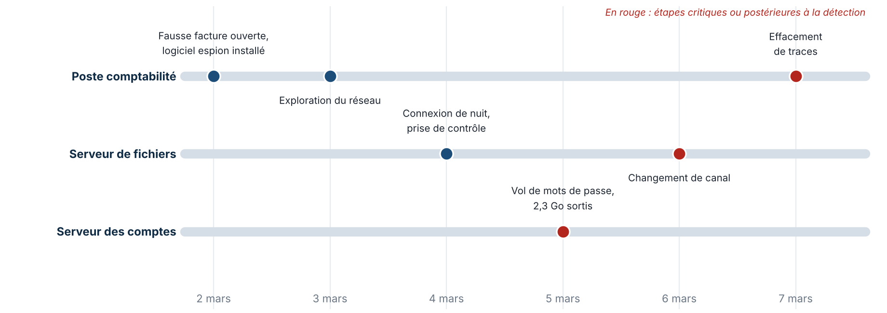

TLP:AMBER

<h1>Intrusion informatique de mars 2026 Synthèse pour la direction</h1>

Incident INC-2026-0302 · Helios Energy · version du 9 octobre 2026 · cellule de renseignement sur les menaces : Marc BOHOUSSOU, [Nom 2], [Nom 3]

## L'essentiel

- **Un attaquant a pris le contrôle du serveur qui gère tous les comptes informatiques de l'entreprise** et en a sorti 2,3 Go de données, dont nous ne connaissons pas encore le contenu.
- **Il était encore actif cinq jours après la détection.** Tant que les machines touchées ne sont pas isolées et les mots de passe renouvelés, il peut revenir.
- **Rien n'a été chiffré ni arrêté à ce jour**, et aucun système de pilotage de l'énergie n'apparaît touché. Mais l'attaquant a réuni ce qu'il faut pour exercer un chantage.
- **L'auteur est très probablement un groupe criminel motivé par l'argent.** Rien n'indique un État. Notre niveau de confiance est moyen.

## Ce qui s'est passé

1. **Lundi 2 mars.** Un salarié de la comptabilité ouvre une fausse facture reçue par courriel. Le fichier installe discrètement un logiciel espion sur son poste. Le salarié signale le fichier le jour même : ce réflexe a permis de détecter l'attaque.
2. **3 et 4 mars.** Depuis ce poste, l'attaquant explore le réseau, puis se connecte de nuit à un serveur de fichiers avec un compte valide.
3. **5 mars.** Il atteint le serveur central des comptes, y vole des mots de passe et envoie 2,3 Go de données vers l'extérieur.
4. **6 et 7 mars.** Il change de canal de communication et efface des traces sur le poste d'origine.

L'attaque visait bien Helios Energy : un faux site portant le nom de l'entreprise avait été préparé.

## Ce que nous savons, ce que nous ignorons

| Établi par les preuves | Encore inconnu |
|---|---|
| Trois machines touchées : un poste, un serveur de fichiers, le serveur central des comptes | Si d'autres machines sont touchées |
| Des mots de passe ont été volés | Le contenu des données sorties |
| 2,3 Go ont quitté l'entreprise | Comment l'attaquant a obtenu son premier compte |
| L'attaquant s'adapte à nos réactions | S'il est encore présent aujourd'hui |

## Qui est derrière

Les outils utilisés ressemblent en partie à ceux d'une famille de groupes criminels connus pour voler des données puis réclamer une rançon. La ressemblance est réelle mais partielle : **nous ne nommons aucun groupe**, car les éléments qui le permettraient sont trop fragiles. Aucun indice technique ne pointe vers un État, malgré le statut d'opérateur d'importance vitale.

Pour la direction, la conséquence pratique est simple : il faut se préparer à **une tentative d'extorsion**, pas à un sabotage.

## Les risques pour l'entreprise

| Risque | Probabilité | Gravité | Conséquence |
|---|---|---|---|
| **Chantage à la publication des données** | Probable | Critique | Atteinte à l'image, obligations envers les personnes concernées, pression financière |
| **Blocage de l'informatique par rançongiciel** | Possible | Critique | Arrêt des services de gestion pendant plusieurs jours ou semaines |
| **Retour de l'attaquant** avec les mots de passe volés | Probable | Élevée | Nouvelle intrusion, plus discrète |
| **Atteinte aux systèmes de pilotage de l'énergie** | Non observée | Critique | À écarter par une vérification du cloisonnement |
| **Manquement aux obligations de déclaration** | Possible | Élevée | Sanctions, perte de confiance des autorités |

## Décisions attendues de la direction

| # | Décision | Pourquoi | Délai |
|---|---|---|---|
| 1 | **Autoriser l'isolement des machines touchées et le renouvellement de tous les mots de passe**, y compris ceux des dirigeants | C'est la seule façon de reprendre la main. L'opération gênera l'activité pendant un à deux jours | Immédiat |
| 2 | **Déclarer l'incident à l'ANSSI**, notifier la CNIL et déposer plainte | Obligations légales d'un opérateur d'importance vitale ; la plainte conditionne aussi l'indemnisation par l'assurance | Immédiat |
| 3 | **Activer une cellule de crise** et arrêter une position sur le paiement d'une rançon | Mieux vaut décider à froid, avant toute demande | Cette semaine |
| 4 | **Faire inventorier les données sorties** | Détermine qui doit être prévenu et l'ampleur réelle du risque | Cette semaine |
| 5 | **Faire vérifier la séparation entre l'informatique de gestion et les systèmes de pilotage** | Seul moyen d'écarter le risque le plus grave | Cette semaine |
| 6 | **Financer le plan de sécurisation** : protection des comptes, surveillance renforcée, sauvegardes hors ligne | Les faiblesses exploitées sont connues et se corrigent | Ce mois-ci |

## Ce que nous livrons au centre de sécurité

Un rapport technique détaillé, quinze règles de détection prêtes à être installées, la liste des éléments à bloquer et un plan d'action en quinze points. Ces livrables permettent de repérer l'attaquant s'il revient avec les mêmes méthodes.

Niveau de confiance. Les faits rapportés ici reposent sur les journaux et analyses fournis par le centre de sécurité, jugés fiables. L'identification de l'auteur est une appréciation, cotée « confiance moyenne » : elle peut évoluer si de nouveaux éléments apparaissent, par exemple une demande de rançon.

