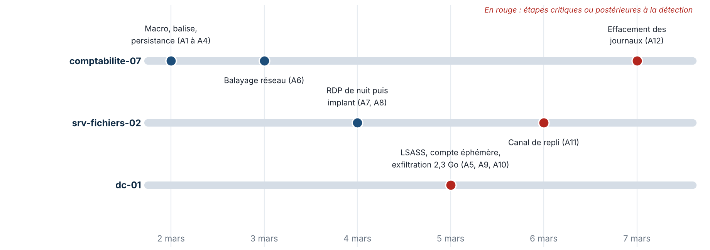

<div class="cover">
<p class="tlp">TLP:AMBER</p>
<h1>Rapport tactique<br>Intrusion Helios Energy</h1>
<p class="sub">Incident INC-2026-0302 · 2 au 7 mars 2026</p>
<table class="meta">
<tr><td>Destinataire</td><td>Responsable et analystes du SOC</td></tr>
<tr><td>Auteurs</td><td>Cellule CTI : Marc BOHOUSSOU, [Nom 2], [Nom 3]</td></tr>
<tr><td>Version</td><td>1.0 du 9 octobre 2026</td></tr>
<tr><td>Sources</td><td>40 indicateurs, 12 alertes SIEM, 3 fiches d'analyse, mémo du SOC</td></tr>
</table>
</div>

## 1. À retenir

1. **L'attaquant est toujours là.** Le poste `comptabilite-07`, signalé le 2 mars, efface son journal Sécurité le 7 mars (alerte 12). Le serveur `srv-fichiers-02` bascule sur un canal de repli le 6 mars (alerte 11). Aucun des deux n'a été isolé.
2. **Le domaine est compromis.** Lecture de la mémoire de LSASS sur `dc-01` le 5 mars (alerte 5), puis 2,3 Go sortis en clair (alerte 10). Tous les secrets du domaine sont à renouveler.
3. **L'hypothèse du mémo est à inverser.** Le serveur de fichiers est atteint le 4 mars, **avant** le vol d'identifiants du 5. L'attaquant possédait déjà un compte valide, d'origine inconnue.
4. **Aucun chiffrement n'est observé.** Le vol d'identifiants, l'exfiltration et l'effacement de traces sont en revanche les étapes qui précèdent habituellement une extorsion.
5. **Attribution** : cluster cybercriminel non nommé (HELIOS-C1), recouvrement partiel avec l'outillage Carbanak/FIN7, **confiance moyenne (B3)**.

**Actions immédiates** : capturer la mémoire puis isoler les deux machines, bloquer les indicateurs de la section 6, lancer la recherche de compromission de la section 8, déployer les règles Sigma de la section 7.

## 2. Périmètre, sources et méthode

L'analyse couvre trois actifs (`comptabilite-07`, `srv-fichiers-02`, `dc-01`) du 2 au 7 mars 2026. Elle repose uniquement sur le dossier remis par le SOC. Les binaires n'ont pas été exécutés : seules leurs fiches d'analyse sont exploitées.

Chaque information porte une cote Admiralty : fiabilité de la source de A à F, crédibilité de l'information de 1 à 6.

| Classe | Cotes | Nombre | Usage dans ce rapport |
|---|---|---|---|
| Socle | A1 à B2 | 26 | Preuve, blocage, détection |
| À corroborer | B3 à C3 | 11 | Surveillance, jamais seul appui d'une conclusion |
| Faible | C4 à D4 | 3 | Hypothèse, exclue de l'attribution |

Une technique n'est retenue que si elle renvoie à un artefact : alerte (A1 à A12), indicateur (n°1 à 40) ou fiche (BIN-01 à 03). Le renseignement est structuré dans MISP et exporté en STIX 2.1 (`stix/`).

**Réserves sur les sources.** Quatre incohérences ont été relevées et traitées :

| Constat | Traitement |
|---|---|
| Les alertes ne sont pas dans l'ordre chronologique : l'alerte 5 date du 5 mars | Chronologie retriée par horodatage |
| Le mémo est daté du 2 mars 10:30 mais décrit des faits du 5 mars | Source cotée B ; ses hypothèses sont vérifiées contre les alertes |
| L'alerte 1 cite `winword.exe`, BIN-01 est un classeur Excel | La règle Sigma 01 couvre toutes les applications Office |
| Les fiches citent IP-07, IP-08, IP-09 ; l'ordre du CSV ne correspond pas | Correspondance établie par le contexte : commande = n°21 et 22, exfiltration = n°24. À confirmer par le SOC |

<div class="pb"></div>

## 3. Chronologie

Heures en UTC.



| Date | Heure | Hôte | Événement | Artefacts |
|---|---|---|---|---|
| 2 mars | 06:40 | externe | Domaine imitant la victime et leurre « portail RH » | n°17, 32 |
| | 07:58 | externe | Page de collecte d'identifiants | n°15, 23, 30, 34 |
| | 08:30 | comptabilite-07 | Ouverture de `facture_mars_2026.xlsm` | BIN-01 |
| | 08:31 | comptabilite-07 | Office lance PowerShell encodé, fenêtre masquée | A1, n°10 |
| | 08:42 | comptabilite-07 | Téléchargement de `svchost_update.exe` | A2, n°13, 29 |
| | 08:44 | comptabilite-07 | Valeur Run `WinTelemetry` | n°38 |
| | 08:46 | comptabilite-07 | Tâche `MicrosoftEdgeUpdateTaskMachine` | A3, n°36 |
| | 09:16 | comptabilite-07 | Balise HTTPS toutes les 300 s environ | A4, n°14, 21 |
| 3 mars | 10:13 | comptabilite-07 | Balayage de 10.20.0.0/16, ports 445 et 3389 | A6, n°25 |
| 4 mars | 01:48 | srv-fichiers-02 | Session RDP hors horaires | A7, n°26 |
| | 11:05 | srv-fichiers-02 | Injection dans `explorer.exe` | A8, n°11 |
| 5 mars | 14:05 | dc-01 | Dépôt de `rundll32_helper.dll` | BIN-03 |
| | 14:07 | dc-01 | Lecture de la mémoire de LSASS | A5 |
| | 14:10 | dc-01 | Compte `svc-backup-temp` créé, supprimé à 14:55 | A9, n°37 |
| | 14:40 | dc-01 | Fichier de collecte chiffré | n°39, 12 |
| | 15:31 | dc-01 | 2,3 Go sortants vers 203.0.113.28:8080 | A10, n°24 |
| 6 mars | 03:10 | srv-fichiers-02 | Bascule vers le domaine de repli | A11, n°16 |
| 7 mars | 09:02 | comptabilite-07 | `wevtutil cl Security` | A12 |

## 4. Chaîne d'attaque

### 4.1 Accès initial et exécution (2 mars)

Un salarié de la comptabilité ouvre un classeur à macro reçu par courriel. La macro décode une charge en base64 et lance PowerShell en fenêtre masquée (alerte 1), qui télécharge la balise BIN-02 depuis `cdn-svc-update[.]test` (alerte 2). Seize minutes séparent l'ouverture du fichier de la persistance.

Un second dispositif existait en parallèle : une page de collecte d'identifiants (n°15, n°30) et un leurre imitant le portail RH de l'entreprise (n°17, n°32), mis en ligne avant l'ouverture du classeur. Aucune alerte ne montre qu'un salarié s'y est connecté.

### 4.2 Persistance et commande (2 mars)

Deux mécanismes sont posés à deux minutes d'intervalle : une valeur Run nommée `WinTelemetry` (BIN-01) et une tâche planifiée qui imite celle de Microsoft Edge (BIN-02). La balise s'injecte dans `explorer.exe` par creux de processus, puis contacte `api-telemetry-eu[.]test` en HTTPS toutes les 300 secondes, avec une variation aléatoire de 20 %. Elle transmet le nom de la machine, l'utilisateur et ses privilèges.

Les serveurs de commande partagent un certificat auto-signé `CN=update-service` (n°33) : c'est le meilleur pivot d'infrastructure du dossier.

### 4.3 Découverte et mouvement latéral (3 et 4 mars)

Le poste balaie le sous-réseau 10.20.0.0/16 sur les ports SMB et RDP (alerte 6). Quinze heures plus tard, une session RDP s'ouvre à 01:47 sur `srv-fichiers-02` (alerte 7), où la balise est injectée le même jour (alerte 8).

**Zone d'ombre n°1.** Cette session RDP précède le vol d'identifiants sur `dc-01`. L'attaquant disposait donc d'un compte valide dès le 4 mars. Trois origines sont possibles : identifiants de l'utilisateur de `comptabilite-07`, mot de passe saisi sur la page d'hameçonnage, ou compte faible. Le dossier ne permet pas de trancher.

### 4.4 Vol d'identifiants, collecte et exfiltration (5 mars)

En 86 minutes sur `dc-01` : dépôt de BIN-03, lecture de la mémoire de LSASS, création d'un compte éphémère, écriture d'un fichier chiffré dans `C:\Windows\Temp`, puis envoi de 2,3 Go en clair vers 203.0.113.28 sur le port 8080.

**Zone d'ombre n°2.** Aucune alerte ne couvre la période du 4 mars 11:05 au 5 mars 14:05. Le passage du serveur de fichiers au contrôleur de domaine n'est pas documenté.

### 4.5 Maintien et effacement (6 et 7 mars)

L'implant du serveur de fichiers bascule sur `static-assets-cache[.]test` après la perte du canal principal. Le lendemain, le journal Sécurité du poste d'entrée est effacé. L'attaquant observe la réponse du SOC et s'y adapte.

### 4.6 Techniques ATT&CK validées

Référentiel ATT&CK v19. L'ancienne tactique « Defense Evasion » y est scindée en « Stealth » et « Defense Impairment » ; T1070.001, citée par l'alerte 12, y porte l'identifiant T1685.005.

| Tactique | Technique | Preuve |
|---|---|---|
| Développement de ressources | T1583.001 Domaines · T1587.003 Certificat auto-signé | n°13, 14, 17 · n°33 |
| Accès initial | T1566.001 Pièce jointe d'hameçonnage ciblé | BIN-01, mémo |
| Exécution | T1204.002 Fichier malveillant · T1059.001 PowerShell | BIN-01 · A1 |
| Persistance | T1547.001 Clé Run · T1053.005 Tâche planifiée | n°38 · A3 |
| | T1543.003 Service Windows · T1136.002 Compte de domaine | BIN-03 · A9 |
| Furtivité | T1027 Encodage · T1564.003 Fenêtre masquée · T1027.002 Empaquetage | A1 · A1 · BIN-02 |
| | T1036.004 Tâche imitant un nom légitime · T1055.012 Creux de processus | n°36 · A8 |
| Affaiblissement des défenses | T1685.005 Effacement des journaux (ex-T1070.001) | A12 |
| Commande et contrôle | T1105 Transfert d'outil · T1071.001 Protocoles web | A2 · A4 |
| | T1573 Canal chiffré · T1008 Canal de repli | BIN-02 · A11 |
| Découverte | T1046 Balayage de services réseau | A6 |
| Mouvement latéral | T1021.001 RDP | A7 |
| Accès aux identifiants | T1003.001 Mémoire de LSASS | A5 |
| Collecte | T1074.001 Mise en attente locale · T1560 Archive chiffrée | n°39 · n°12 |
| Exfiltration | T1048.003 Protocole non chiffré hors canal de commande | A10 |

**Écart avec l'étiquetage du SIEM.** L'alerte 9 est étiquetée T1543.003 (service Windows), alors que son détail décrit la création d'un compte dans l'annuaire, soit T1136.002. T1543.003 reste valable pour BIN-03, dont la fiche décrit un service créé puis supprimé.

## 5. Diamond Model et attribution

| Sommet | Contenu |
|---|---|
| **Adversaire** | Cluster HELIOS-C1, non nommé. Un même outilleur pour BIN-01 et BIN-02 (chaîne « build 7.3 ») |
| **Capacité** | Classeur à macro, balise HTTPS empaquetée (UPX modifié), outil générique de vol d'identifiants, PowerShell, RDP, wevtutil |
| **Infrastructure** | Livraison, commande et repli sur des domaines imitant des services de mise à jour ; certificat auto-signé commun ; exfiltration directe vers une adresse IP |
| **Victime** | Helios Energy, opérateur d'importance vitale. Comptabilité, puis serveur de fichiers et contrôleur de domaine |

**Jugement : cluster cybercriminel à motivation financière probable, recouvrement partiel avec l'outillage Carbanak/FIN7, confiance moyenne (B3).**

- **Pour** : format de la balise (fiche BIN-02), leurre à thème financier, enchaînement vol d'identifiants puis exfiltration. Au moins 12 des 25 techniques figurent sur la fiche ATT&CK de FIN7.
- **Contre une attribution nommée** : ces 12 techniques sont génériques ; les plus caractéristiques (creux de processus, balise HTTPS, LSASS) n'y figurent pas ; la fiche BIN-02 demande elle-même de « ne pas conclure sur ce seul élément » ; aucun lien d'infrastructure fiable.
- **Acteur étatique** : aucun artefact. L'exfiltration en clair et l'outillage générique s'accordent mal avec de l'espionnage discret.

Les indicateurs n°27, 28 et 35 (C4 et D4), seuls à relier l'incident à une activité antérieure, sont exclus du raisonnement. Le détail figure dans `notes/04_note_attribution.md`.

## 6. Indicateurs à exploiter

Valeurs neutralisées. La liste complète, cotée et sourcée, est dans MISP et dans le bundle STIX.

### À bloquer et à rechercher dans l'historique (A1 à B2)

| Type | Valeur | Rôle | Cote |
|---|---|---|---|
| Domaine | `cdn-svc-update[.]test` | Livraison de BIN-02 | B2 |
| Domaine | `api-telemetry-eu[.]test` | Commande | B2 |
| IP | 198.51.100.23 · 198.51.100.24 | Résolution des deux domaines | B2 |
| IP | 203.0.113.14 | Serveur de commande principal | B2 |
| IP | 203.0.113.28 (port 8080) | Exfiltration | B2 |
| Certificat SHA-1 | `BDA5D6C36E3FF362F9CE0957370A429FFF58EB37` | Serveurs de commande, `CN=update-service` | B2 |
| SHA-256 | `2d10d13c…0d66e5` | BIN-01 `facture_mars_2026.xlsm` | A1 |
| SHA-256 | `cdf03e90…78ebc9` | BIN-02 `svchost_update.exe` | A1 |
| SHA-256 | `f4109cd2…9135f0` | BIN-03 `rundll32_helper.dll` | A1 |
| Tâche planifiée | `MicrosoftEdgeUpdateTaskMachine` | Persistance | A2 |
| Registre | `HKCU\…\Run\WinTelemetry` | Persistance | A2 |
| Fichier | `C:\Windows\Temp\~df3a9.tmp` | Collecte avant exfiltration | B2 |
| Compte | `svc-backup-temp` | Compte éphémère sur `dc-01` | B2 |

**À surveiller sans bloquer (B3 à C3)** : `mail-secure-login[.]test` et 198.51.100.40 (hameçonnage), `helios-energy-portal[.]test` (usurpation), `static-assets-cache[.]test` et 203.0.113.15 (repli), 203.0.113.44 (RDP, contredit par l'alerte 7), `update-win-msft[.]test` (rôle non éclairci).

**À ne pas déployer** : n°27, 28, 35 (non corroborés) ; n°25, 198.51.100.55, qui est probablement l'adresse du poste compromis et non une infrastructure de l'attaquant.

Les empreintes et les adresses sont les indicateurs les plus faciles à changer pour l'attaquant. Les règles de la section suivante visent ses comportements, plus coûteux à modifier.

## 7. Règles de détection Sigma

Quinze règles sont livrées dans `sigma/`. Les 12 alertes de l'incident sont couvertes.

| # | Détecte | Source de journaux | ATT&CK | Alerte | Niveau |
|---|---|---|---|---|---|
| 01 | Application Office qui lance PowerShell encodé ou masqué | Création de processus | T1059.001 | A1 | Élevé |
| 02 | Exécutable téléchargé depuis un domaine de la campagne | Proxy | T1105 | A2 | Élevé |
| 03 | Tâche imitant Edge Update, créée par schtasks | Création de processus | T1053.005 | A3 | Élevé |
| 04 | Valeur Run `WinTelemetry` | Registre | T1547.001 | n°38 | Élevé |
| 05 | Résolution d'un domaine de la campagne | DNS | T1071.001, T1008 | A4, A11 | Élevé |
| 06 | `explorer.exe` lancé par un parent inhabituel | Création de processus | T1055.012 | A8 | Moyen |
| 07 | Session RDP sur un serveur hors réseau d'administration | Sécurité 4624 | T1021.001 | A7 | Moyen |
| 08 | Lecture de la mémoire de LSASS | Sysmon 10 | T1003.001 | A5 | Critique |
| 09 | Création ou suppression de `svc-backup-temp` | Sécurité 4720, 4726 | T1136.002 | A9 | Élevé |
| 10 | Connexion vers une adresse de commande ou d'exfiltration | Pare-feu | T1048.003 | A4, A10 | Critique |
| 11 | Effacement de journal avec wevtutil | Création de processus | T1685.005 | A12 | Élevé |
| 12 | Dépôt des outils ou du fichier de collecte | Création de fichier | T1074.001 | n°39 | Élevé |
| 13 | Compte créé puis supprimé en moins d'une heure | Sécurité, corrélation | T1136.002 | A9 | Élevé |
| 14 | Exécution de BIN-02 ou BIN-03 par empreinte | Création de processus | T1204.002 | n°4, 7 | Critique |
| 15 | Une source contacte 30 hôtes ou plus sur 445/3389 en 5 min | Pare-feu, corrélation | T1046 | A6 | Moyen |

### Exemple, règle 03

```yaml
title: Tâche planifiée imitant Microsoft Edge Update créée par schtasks
status: experimental
logsource:
    category: process_creation
    product: windows
detection:
    selection_img:
        Image|endswith: '\schtasks.exe'
    selection_cli:
        CommandLine|contains|all:
            - '/create'
            - 'MicrosoftEdgeUpdateTask'
    filter_edge_installer:
        ParentImage|contains: '\Microsoft\EdgeUpdate\'
    condition: selection_img and selection_cli and not filter_edge_installer
level: high
```

Les tâches légitimes d'Edge sont créées par son installeur, pas par `schtasks.exe` : la règle reste valable si l'attaquant change le suffixe du nom. Sa conversion pour Splunk :

```
source="WinEventLog:Microsoft-Windows-Sysmon/Operational" EventCode=1
Image="*\\schtasks.exe" CommandLine="*/create*" CommandLine="*MicrosoftEdgeUpdateTask*"
NOT ParentImage="*\\Microsoft\\EdgeUpdate\\*"
```

### État de validation

| Contrôle | Résultat |
|---|---|
| `sigma check` (sigma-cli 3.1.0) | 0 erreur, 0 problème sur les 15 fichiers |
| Conversion Splunk | 14 règles converties (`sigma/_conversion_splunk.spl`) |
| Règle 13 | Convertie pour le moteur EQL d'Elastic uniquement |
| Rejeu sur des journaux | **Non réalisé** : volet optionnel non retenu. Les taux de faux positifs sont à mesurer avant mise en production |

**Prérequis et réglages.** Huit règles supposent Sysmon ou un EDR journalisant la ligne de commande. La règle 07 contient une plage d'administration d'exemple (10.20.99.0/24) à remplacer. Le seuil de la règle 15 est à ajuster au bruit de fond.

**Ce que Sigma ne couvre pas.** La balise périodique ne s'exprime pas en Sigma. Elle se chasse dans les journaux du proxy : pour chaque couple poste-destination, repérer les séries de connexions espacées de 240 à 360 secondes pendant plusieurs heures.

## 8. Recommandations

### Immédiat (24 heures)

| # | Action | Justification |
|---|---|---|
| 1 | Capturer la mémoire de `comptabilite-07` et `srv-fichiers-02`, puis les isoler du réseau | Implants actifs les 6 et 7 mars. La charge PowerShell et le module injecté n'existent qu'en mémoire (n°10, 11) |
| 2 | Bloquer les domaines et adresses cotés B2 sur le proxy, le DNS et le pare-feu | Section 6 |
| 3 | Interdire toute sortie Internet directe depuis `dc-01` | 2,3 Go sont sortis d'un contrôleur de domaine |
| 4 | Conserver les journaux du proxy, du pare-feu et de l'annuaire, hors des machines touchées | Le journal de `comptabilite-07` a déjà été effacé |

### Court terme (une semaine)

| # | Action | Justification |
|---|---|---|
| 5 | Renouveler tous les secrets du domaine : compte `krbtgt` deux fois, comptes à privilèges, comptes de service | LSASS lu sur `dc-01` |
| 6 | Rechercher sur tout le parc : tâche `MicrosoftEdgeUpdateTaskMachine`, valeur `WinTelemetry`, fichiers de la règle 12, comptes créés depuis le 2 mars | Le balayage du 3 mars a visé tout le sous-réseau |
| 7 | Rechercher dans le proxy les connexions à `mail-secure-login[.]test` et identifier les salariés concernés | Origine possible du compte utilisé le 4 mars |
| 8 | Déployer les 15 règles Sigma, en observation puis en alerte | Section 7 |
| 9 | Vérifier que les sauvegardes sont hors ligne et restaurables | Risque de chiffrement |

### Moyen terme (un mois)

| # | Action | Technique contrée |
|---|---|---|
| 10 | Bloquer les macros des documents venant d'Internet | T1204.002 |
| 11 | Protéger LSASS (mode protégé, Credential Guard) | T1003.001 |
| 12 | Réserver le RDP à un bastion, avec authentification à plusieurs facteurs | T1021.001 |
| 13 | Centraliser les journaux en temps réel, avec alerte sur tout effacement | T1685.005 |
| 14 | Journaliser les blocs de script PowerShell et déployer Sysmon | T1059.001 |
| 15 | Cloisonner le réseau bureautique et les serveurs d'infrastructure | T1046 |

## 9. Lacunes et questions ouvertes

| Question | Donnée qui permettrait d'y répondre |
|---|---|
| Quel compte a servi pour le RDP du 4 mars ? | Événements 4624 de `srv-fichiers-02`, journaux du proxy vers la page d'hameçonnage |
| Comment l'attaquant est-il passé du serveur de fichiers à `dc-01` ? | Journaux d'authentification du 4 mars 11:05 au 5 mars 14:05 |
| Que contenaient les 2,3 Go ? | Image du disque de `dc-01`, flux réseau, inventaire des partages |
| D'autres salariés ont-ils reçu un leurre ? | Journaux de la messagerie, en-têtes du courriel initial |
| 203.0.113.44 est-elle une source externe ? | Journaux du pare-feu : l'alerte 7 parle d'une source interne |
| D'autres machines sont-elles touchées ? | Résultats de la recherche de compromission (action 6) |

<div class="keep">

## Annexe. Livrables associés

| Livrable | Emplacement |
|---|---|
| Bundle STIX 2.1 et sauvegarde de l'événement MISP | `stix/` |
| Graphe du renseignement | `graphe/` |
| Règles Sigma et conversions | `sigma/` |
| Triage des 40 indicateurs | `notes/02_triage_iocs.md` |
| Note d'attribution | `notes/04_note_attribution.md` |
| Matrice de risques CID | `notes/05_matrice_risques_CID.md` |
| Notes ANSSI et de partage | `notes/06_note_ANSSI.md`, `notes/07_note_partage_TLP.md` |

</div>
